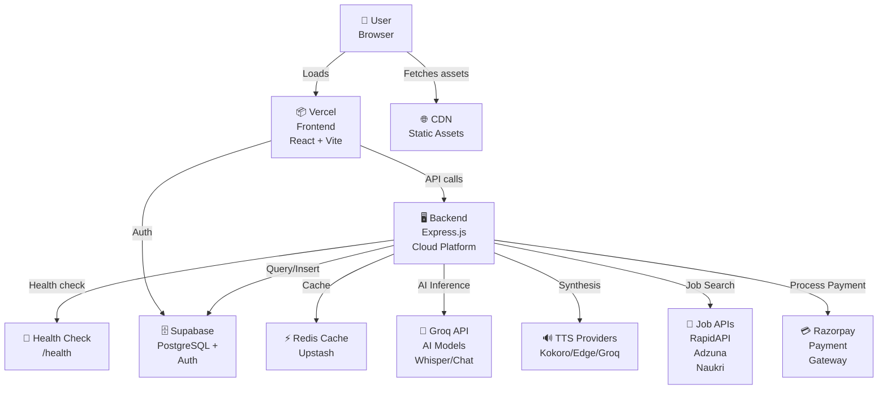
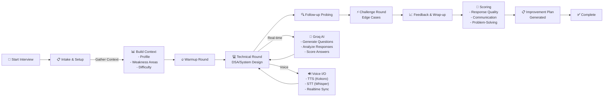
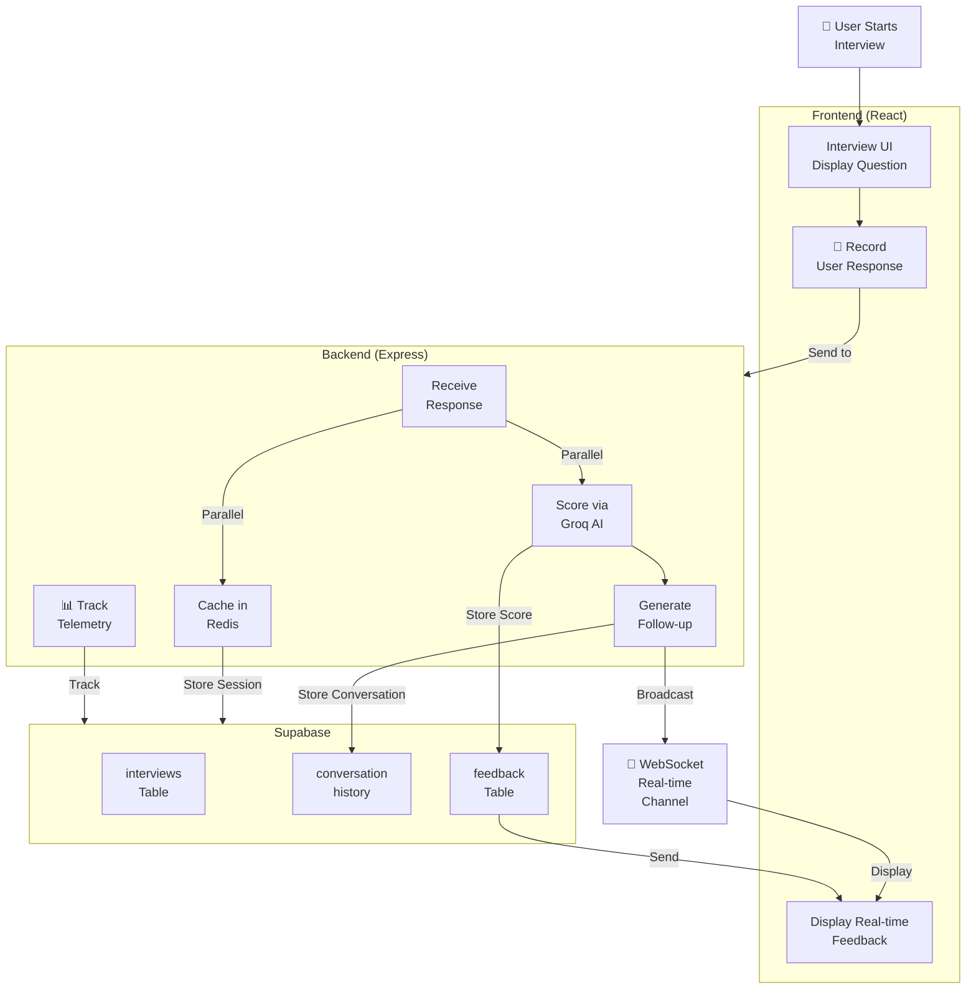
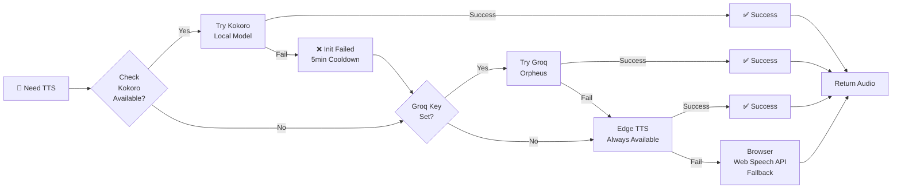
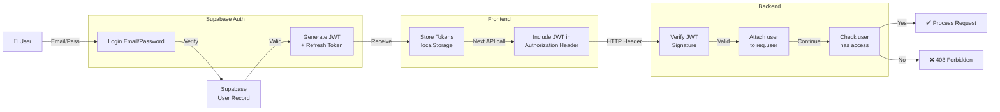
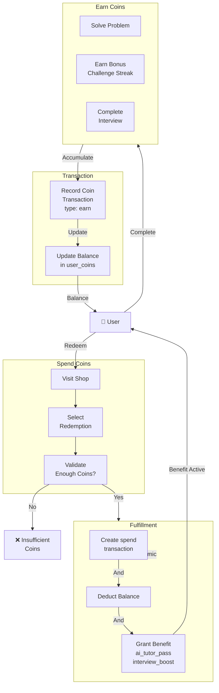
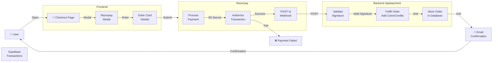
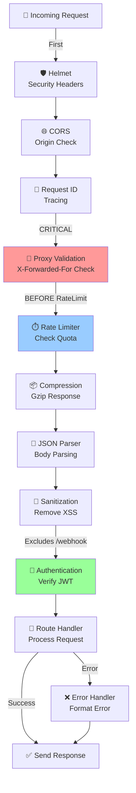

# PrepLoop Architecture Diagrams

This document contains visual representations of PrepLoop's architecture, data flows, and system interactions.

## System Overview



## Interview Suite Flow



## Data Flow: Interview Session



## Voice Provider Chain (Fallback)



## Authentication Flow



## Coin & Payment System



## Payment Processing (Razorpay)



## Middleware Execution Order



## Real-Time WebSocket Architecture

```mermaid
graph TB
    Client1["💻 Client 1<br/>Chrome"]
    Client2["💻 Client 2<br/>Safari"]
    Client3["💻 Client 3<br/>Firefox"]
    
    subgraph WSServer["WebSocket Server<br/>PORT 5000"]
        Verify["🔐 Verify JWT<br/>on connect"]
        ClientMap["clients Map<br/>clientId → ws"]
        RoomMap["rooms Map<br/>roomId → [clients]"]
    end
    
    subgraph Message["Message Handling"]
        JoinRoom["Join Room"]
        Broadcast["Broadcast<br/>to Room"]
        Leave["Leave Room"]
    end
    
    Client1 -->|ws://...?token=JWT| Verify
    Client2 -->|ws://...?token=JWT| Verify
    Client3 -->|ws://...?token=JWT| Verify
    
    Verify -->|Success| ClientMap
    ClientMap -->|Store| RoomMap
    
    Client1 -->|{type: join_room}| JoinRoom
    JoinRoom -->|Subscribe| RoomMap
    
    Client1 -->|Send message| Broadcast
    Broadcast -->|To all in room| Client2
    Broadcast -->|To all in room| Client3
    
    Client2 -->|Disconnect| Leave
    Leave -->|Cleanup| RoomMap
```

## Database Schema (Interview Focus)

```mermaid
erDiagram
    USERS ||--o{ INTERVIEWS : creates
    USERS ||--o{ INTERVIEW_CONVERSATIONS : has
    USERS ||--o{ INTERVIEW_FEEDBACK : generates
    USERS ||--o{ USER_COINS : owns
    
    INTERVIEWS ||--o{ INTERVIEW_ROUNDS : contains
    INTERVIEWS ||--o{ INTERVIEW_CONVERSATIONS : has
    INTERVIEWS ||--o{ INTERVIEW_FEEDBACK : generates
    
    INTERVIEW_ROUNDS ||--o{ INTERVIEW_QUESTIONS : asks
    INTERVIEW_QUESTIONS ||--o{ INTERVIEW_RESPONSES : answered_by
    
    INTERVIEW_CONVERSATIONS ||--o{ INTERVIEW_RESPONSES : logs
    
    USERS {
        uuid id PK
        string email UK
        string full_name
        int skill_level
        timestamp created_at
    }
    
    INTERVIEWS {
        uuid id PK
        uuid user_id FK
        string type "technical, behavioral, hr, system_design"
        int total_questions
        int total_turns
        int final_score
        string status "in_progress, completed"
        timestamp created_at
    }
    
    INTERVIEW_ROUNDS {
        uuid id PK
        uuid interview_id FK
        int round_number
        string topic
        int score
        timestamp completed_at
    }
    
    INTERVIEW_CONVERSATIONS {
        uuid id PK
        uuid interview_id FK
        uuid user_id FK
        string role "interviewer, candidate"
        string message
        timestamp created_at
    }
    
    INTERVIEW_FEEDBACK {
        uuid id PK
        uuid interview_id FK
        uuid user_id FK
        text strengths
        text weaknesses
        text improvement_areas
        timestamp generated_at
    }
    
    USER_COINS {
        uuid user_id PK FK
        int balance
        timestamp updated_at
    }
```

---

**Use these diagrams to understand system architecture, data flows, and component interactions.**

For detailed documentation, see `.github/copilot-instructions.md` and `docs/ARCHITECTURE.md`.
